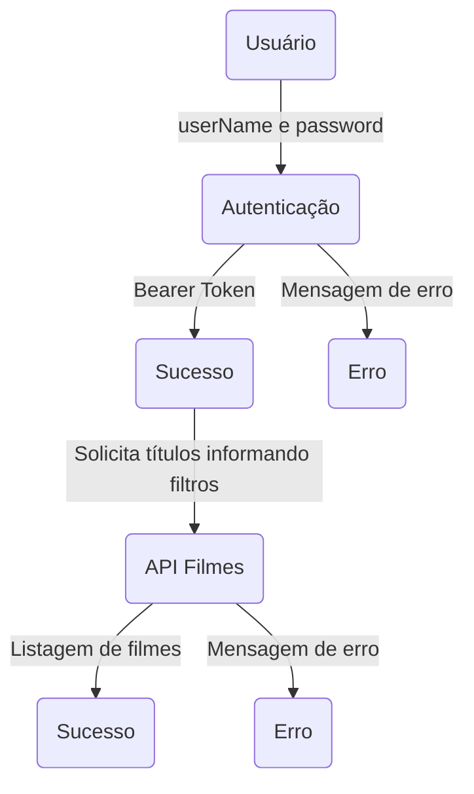

# APIRest

# Índice

- [Descrição](#descrição)
- [Fluxo do projeto](#fluxo-do-projeto)
- [Info](#info)
- [Rodando localmente](#rodando-localmente)
- [Regras de negócio](#regras-de-negócio)

# Descrição

Este projeto tem como objetivo implementar um API do tipo Rest para fornecer um catálogo de filmes para o usuário.
Para que um usuário possa obter títulos, deverá fazer autenticação para gerar um Bearer token e informá-lo na solicitação.

# Fluxo do projeto



# Info:
- **Tipo**: API Rest
- **Lang**: Java
- **Tecnologia**: Spring Boot
- **Banco de dados**: MySql
	
# Rodando localmente:

Realize o clone do projeto:

```shell
git clone https://github.com/flpfraga/API-Hateoas-Spring-JWT.git
cd API-Hateoas-Spring-JWT
```

Abra o projeto em uma IDE com suporte a Spring Boot e execute.

# Regras de negócio:

- **Autenticação**:
	Autenticar usuário cadastrado e gerar token formato Bearer: POST/api/auth/v1 - passar em formato JSON parametro "userName" e "password"

- **Usuário comum**:
	Cadastro de usuário novo: POST/api/user/v1 - passar em formato JSON parametro "userName", "password" e "fullName" (fullName opcional)
	Update de usuário: PUT/api/user/v1/{id} - passar em formato JSON parametro "userName", "password" e "fullName" (fullName opcional)
	Desativar usuário (exclusão lógica): PATCH/api/user/v1/desable{id}
	Adicionar Voto para um filme: PATCH/api/user/v1/vote/{id} - informar parâmetro movie_id e vote

- **Usuário Administrativo**:
	Buscar todos usuários ativos: GET/api/admin/v1/users_active
	Cadastro de usuário novo: POST/api/admin/v1 - passar em formato JSON parametro "userName", "password" e "fullName" (fullName opcional)
	Update de usuário: PUT/api/admin/v1/{id} - passar em formato JSON parametro "userName", "password" e "fullName" (fullName opcional)
	Desativar usuário (exclusão lógica): PATCH/api/admin/v1/desable/{id}
	Criar um novo filme: POST/api/admin/v1/movie - passar em formato JSON parametro "title", "directo", "genre", "details", "actor"[]
	Update de filme: PUT/api/admin/v1/movie/id/{id} - passar em formato JSON parametro "title", "directo", "genre", "details", "actor"[]

- **Consultas de filmes**:
	Todos filmes ordenado pelo nome: GET/api/movie/v1 - opção de paginação que ocorrerá caso seja passado o parâmetro page
	Todos filmes ordenado pelo nota: GET/api/movie/v1/top_rated - opção de paginação que ocorrerá caso seja passado o parâmetro page
	Filmes filtrados pelo diretor: GET/api/movie/v1/director - deverá ser informado parâmetros da busca e opção de paginação que ocorrerá caso seja passado o parâmetro page
	Filmes filtrados pelo nome: GET/api/movie/v1/title - deverá ser informado parâmetros da busca e opção de paginação que ocorrerá caso seja passado o parâmetro page	
	Filmes filtrados pelo genero: GET/api/movie/v1/genre - deverá ser informado parâmetros da busca e opção de paginação que ocorrerá caso seja passado o parâmetro page


Comnado para container (docker). Na pasta ./empresa-java: docker compose up -d --build

[](https://hub.docker.com/repository/docker/felipefragaff/ioasys-api)
